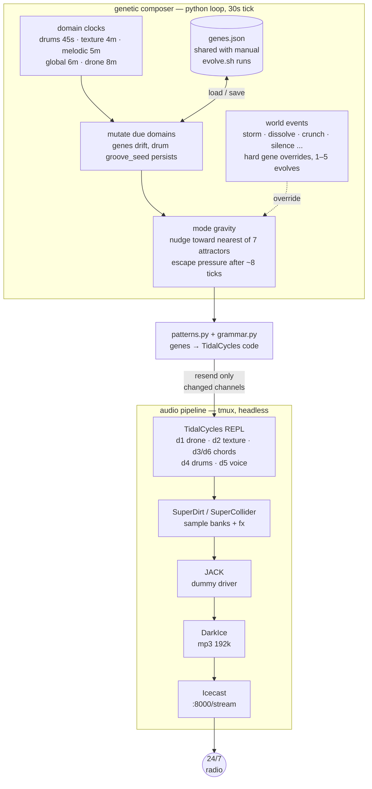
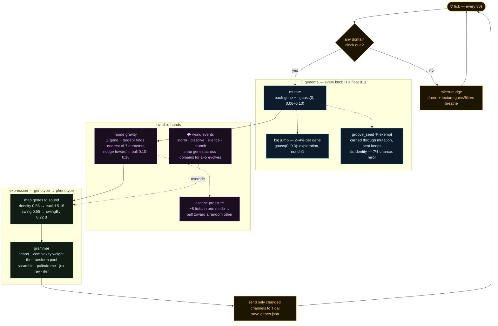

# eul

Always-on generative music radio station. Streams 24/7 at `http://204.168.163.80:8000/stream`.

## How it works



- **TidalCycles** — pattern language. Each `d1`–`d6` line is one audio channel.
- **SuperDirt** — loads your samples, handles effects (reverb, delay, filters, etc.)
- **JACK** — virtual audio cable between SuperCollider and DarkIce (headless, no soundcard needed)
- **DarkIce** — encodes the JACK audio to MP3 192kbps
- **Icecast** — serves it as an HTTP stream
- **src/eul/** — genetic self-evolving composer. Each domain evolves on its own clock.

---

## Scripts

| Script | Usage | What it does |
|--------|-------|-------------|
| `./scripts/status.sh` | Anytime | Checks all processes, stream, JACK routing, loaded banks |
| `./scripts/evolve.sh` | Anytime | Force-evolves all domains and sends patterns |
| `./scripts/evolve.sh --micro` | Anytime | Micro nudge (gains/filters/drum rhythm only) |
| `./scripts/evolve.sh --print` | Anytime | Prints current genome state, domain intervals, nearest mode |
| `./scripts/evolve.sh --event <name>` | Anytime | Manually fire a world event |
| `./scripts/audition.sh` | When tuning gains | Interactive mixer — play banks, adjust gains, get report |
| `./scripts/add-bank.sh <folder> <strain> [opts]` | Adding a new sample bank | Full workflow: preprocess → audition → register → deploy |
| `./scripts/normalize-samples.sh <folder>` | Manual preprocessing | Compress + normalize to consistent loudness |
| `./scripts/fade-samples.sh <folder>` | Manual preprocessing | Add short fade-in/out to prevent clicks |

---

## Genetic composer

The engine evolves itself via `src/eul/` running in tmux window 6. Each sound domain is a separate genetic lifeform with its own mutation rate and clock.

### Anatomy of the engine



Blue = genetics, purple = the forces that shape drift, green = how genes become sound. The loop never resolves — that's the point.

```
src/eul/
  genome.py        — GenomePath base class (mutate, nudge_toward, apply_override)
  genomes/
    drone.py       — DroneGenome      (rate=0.06, clock=8min)
    texture.py     — TextureGenome    (rate=0.10, clock=4min)
    percussive.py  — PercussiveGenome (rate=0.18, clock=90s)
    melodic.py     — MelodicGenome    (rate=0.10, clock=5min)
    global_.py     — GlobalGenome     (rate=0.08, clock=6min)
  banks.py         — sample bank registry (strain class hierarchy)
  grammar.py       — gene-driven TidalCycles transform selection
  events.py        — world events system
  modes.py         — 7 mode attractors (gravitational, not hard switches)
  patterns.py      — pattern builders, one per channel
  send.py          — tmux → TidalCycles REPL
  evolve.py        — main loop: independent domain clocks + world events
```

### Domain clocks

Each domain evolves independently. They fall in and out of phase, creating emergent complexity from overlapping cycles.

| Domain | Clock | Mutation rate | Controls |
|--------|-------|--------------|---------|
| `percussive` | 90s | 0.18 | drums — rhythm, bank crossfade, chaos |
| `texture` | 4min | 0.10 | atmospheric layer — density, speed, samples |
| `melodic` | 5min | 0.10 | chords, voice — bank drift, pitch, rhythm, delay |
| `global` | 6min | 0.08 | tempo, complexity, randomness |
| `drone` | 8min | 0.06 | foundation — gain, filter sweep, pitch |

### Modes

Gravitational attractors — the system drifts toward the nearest one, never hard-snaps.

| Mode | Character |
|------|-----------|
| `minimal` | drone + texture only — pure ambient, no rhythm |
| `sparse` | drone + texture + chords, no drums |
| `percussive` | drone + drums only, no melody |
| `melodic` | drone + chords, no drums, voice optional |
| `full` | all layers active |
| `balanced` | all layers, nothing dominant |
| `glitch` | chaotic drums + texture, broken feel |

### World events

Sudden global shifts that override genes across multiple domains. Fire probabilistically (~hours apart) or manually.

| Event | Character | Duration |
|-------|-----------|----------|
| `crunch` | high drum chaos, boost complexity, dry drone | 1–3 evolves |
| `dissolve` | sparse drums, wet reverb everything, low complexity | 2–4 evolves |
| `storm` | max drum chaos + density, fast tempo | 1–2 evolves |
| `silence` | near-silence, slow tempo, minimal everything | 1–2 evolves |
| `glitch_burst` | full chaos on drums + texture, one shot | 1 evolve |
| `harmonic_shift` | randomize interval genes + drone pitch | 2–5 evolves |

```bash
./scripts/evolve.sh --event crunch   # fire manually
# tune probability: edit EVENT_PROBABILITIES in events.py
```

**Gene state** persists to `/opt/eul/state/genes.json` — evolution survives server restarts. Auto-migrates from older formats.

---

## Sample bank system

Banks are registered in `banks.py` using a strain class hierarchy. Strain defines defaults; banks override only what differs.

### Strains

| Strain | Channel | Rules | Looping default |
|--------|---------|-------|----------------|
| `Drone` | d1 | — | yes |
| `Texture` | d2 | exclusive | yes |
| `Chord` | d3/d6 | exclusive | yes |
| `Voice` | d5 | exclusive | no |
| `Drum` | d4 | — | no |

**`exclusive`** — only one bank of this strain plays at a time. Rules are declarative tags; adding/removing them is one-line.

### Adding a new bank

```bash
./scripts/add-bank.sh samples/percussive/mynewkit Drum --slices 20
./scripts/add-bank.sh samples/melodic/chords/mypad Chord --weight 3
```

The script handles everything: normalize + fade preprocessing, rsync to server, SuperCollider restart, 15s automated audition on the correct channel, then (if you confirm) registers the bank in `banks.py` and deploys.

Options: `--slices N` (required for Drum), `--weight N`, `--no-loop` (Chord only), `--samples N` (override auto-count), `--skip-prep`.

### Current banks

| Bank | Strain | Path | Contents |
|------|--------|------|----------|
| `drone` | Drone | `samples/drone/` | Whitney Dark Choir (×2), cataamb2 |
| `texture` | Texture | `samples/texture/` | catafx7, disconeblip, droid11×2, rain |
| `ls` | Chord | `samples/melodic/chords/ls/` | 9 pad WAVs — looping |
| `akatosh_chord` | Chord | `samples/melodic/chords/akatosh_chord/` | 1 pad — looping |
| `blackmirror` | Chord | `samples/melodic/chords/blackmirror/` | 1 pad — looping |
| `discoveryone` | Chord | `samples/melodic/chords/discoveryone/` | 1 pad — looping |
| `shxc` | Chord | `samples/melodic/chords/shxc/` | 1 short stab — long reverb/delay tails |
| `t99` | Chord | `samples/melodic/chords/t99/` | 1 short chord stab — long reverb/delay tails |
| `madonna` | Voice | `samples/melodic/singletone/madonna/` | Frozen acapella |
| `akatosh_voice` | Voice | `samples/melodic/singletone/akatosh_voice/` | 1 sample |
| `discoveryone_voice` | Voice | `samples/melodic/singletone/discoveryone/` | 1 sample |
| `rad` | Drum | `samples/percussive/rad/` | 37 slices |
| `shxc1` | Drum | `samples/percussive/shxc1/` | 15 slices |

---

## Server

- **IP:** 204.168.163.80
- **Provider:** Hetzner CPX22
- **OS:** Ubuntu 24.04
- **SSH:** `ssh root@204.168.163.80`
- **Logs:** `/var/log/eul/`
- **Gene state:** `/opt/eul/state/genes.json`

## tmux windows

| Window | What's running |
|--------|---------------|
| 0 | Xvfb (virtual display for sclang Qt) |
| 1 | JACK (virtual audio routing) |
| 2 | SuperCollider + SuperDirt |
| 3 | Icecast |
| 4 | DarkIce |
| 5 | **TidalCycles REPL ← work here** |
| 6 | evolve loop (genetic composer) |

Navigate: `Ctrl+b` + window number. Detach without stopping: `Ctrl+b d`.

---

## Checking stream health

```bash
./scripts/status.sh
curl -I http://204.168.163.80:8000/stream   # 200 = live
```

---

## Restarting everything

```bash
ssh root@204.168.163.80
bash /opt/eul/setup/start.sh
# wait ~30 seconds for SuperDirt to boot
./scripts/evolve.sh
```
